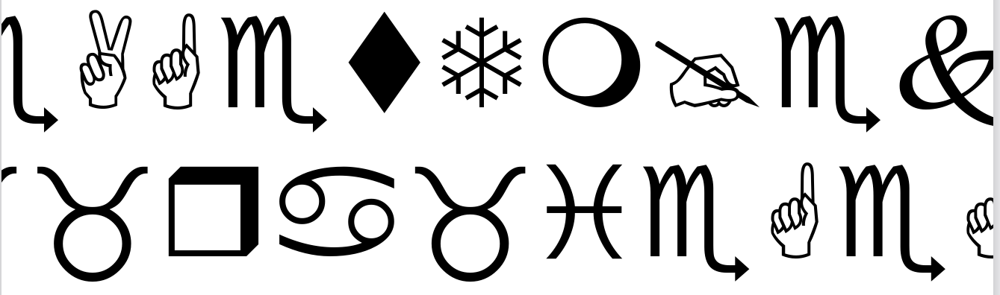
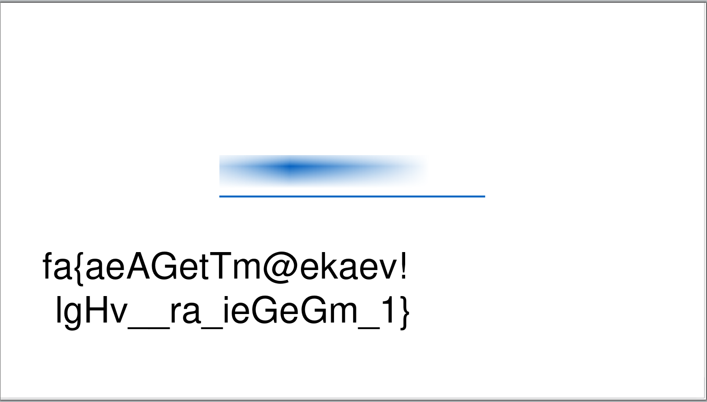
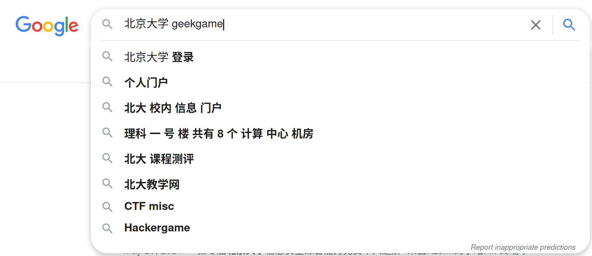

# GeekGame 1st Writeup by mariodon

## 前言

或许是因为上个月 fork HackerGame Writeup 的关系，Github 决定在这个比赛前一天给我推了上一届 GeekGame 的资料。于是我看了下题目，感觉和 HackerGame 一样有趣，这次也就打着玩玩了。题目整体比 HackerGame 难，上来签到题就卡着差点被劝退了，好在细看题还是找到了点稍微软一点的柿子捏（

或许也是因为简单的题目少吧，这次花的时间也没 HackerGame 那么多，最后名次居然也比 HackerGame 里的高。虽然不排除因为这是第一届，参赛人数没那么多的原因？嘛，名次不名次也不重要，开心就行。

## 签到


啊，是小时候流行的沙雕字体 Wingdings。
我首先试着在 Firefox 中选中复制，得到了这些文字：

```
AGetTm@e
_ra_ieGeG
```

看似明文非明文，由于有单词 Get 的出现，我猜这段文字可能是被压缩过了。于是尝试了一圈常见压缩算法，然而还是一无所获。

后来我盯着这段图案看的时候，偶然间意识到：最右边的手指被截了一半，会不会还会有其他文字。

于是进行一个 Ctrl + A，得到了 flag。

```
fa{aeAGetTm@ekaev!
lgHv__ra_ieGeGm_1}
```

好难的签到题，耗了一个多小时。

在写 writeup 时，随手试了一下 LibreOffice 打开，差点喷了。



## 小北问答 Remake

1. 北京大学燕园校区有理科 1 号楼到理科 X 号楼，但没有理科 (X+1) 号及之后的楼。X 是？

   打开缺德地图，从 1 号楼开始搜，能发现搜不到 5 号楼以后的结果。

2. 上一届（第零届）比赛的总注册人数有多少？

   搜索 `北京大学 geekgame`，能看到很多无端转载的上一界闭幕的新闻 [新闻原地址](https://news.pku.edu.cn/xwzh/203d197d93c245a1aec23626bb43d464.htm)

   Google 甚至还记得的上一届的问答题（
   

3. geekgame.pku.edu.cn 的 HTTPS 证书曾有一次忘记续期了，发生过期的时间是？

   这题我会。为了防止各个 CA 恶意签发证书，CA 会提交新签证书的信息。这个标准被叫作 Certificate Transparency。直接上 crt.sh 查这个域名证书发行记录即可。

4. 2020 年 DEFCON CTF 资格赛签到题的 flag 是？

   搜索 Defcon CTF 2020 Writeup 能知道签到题叫 welcome-to-dc2020-quals。加上题名作为关键词搜能搜到题目的 [archive](https://archive.ooo/c/welcome-to-dc2020-quals/358/)。

5. 在大小为 672328094 \* 386900246 的方形棋盘上放 3 枚（相同的）皇后且它们互不攻击，有几种方法？

   没答出来的一问。

   在第二阶段得到提示：有专门的数列解决这题。于是我就去 OEIS 上碰运气，搜到了 A047659 ("Number of ways to place 3 nonattacking queens on an n X n board.")，并且在公式信息里看到了 m\*n 时候的通式。然而公式太长，贴不到 WolframAlpha 里面。于是我把公式里的 ^ 替换成了 \*\*，在 Python 里计算后提交得到的答案，还是不对。不想在分数不高的问答题上花更多时间，我就溜了。

   后来看别人 writeup 才知道 Python 里直接算会有精度问题。坑死了。

6. 上一届（第零届）比赛的“小北问答 1202”题目会把所有选手提交的答案存到 SQLite 数据库的一个表中，这个表名叫？

   去上一界的[仓库](https://github.com/PKU-GeekGame/geekgame-0th)阅读源代码即可。

7. 国际互联网由许多个自治系统（AS）组成。北京大学有一个自己的自治系统，它的编号是？

   查 AS 怎么能少了 [HE](https://bgp.he.net) 呢。

8. 截止到 2021 年 6 月 1 日，完全由北京大学信息科学技术学院下属的中文名称最长的实验室叫？

   找到学院的网站。学院网站系所中心下把实验室都过一遍就好。

## 翻车的谜语人

是 pcap 分析题。在 Wireshark 中过滤 http，大体看一遍，能知道是 Jupyter Notebook 的包。

其中有这么两个包非常引人注意。

`GET /api/contents/flag1.txt?type=file&format=text&_=1636184605693 HTTP/1.1\r\n`

`GET /files/flag2.7z?download=1 HTTP/1.1\r\n`

flag1 是个加密过的文本文件，flag2 是个加密了的压缩包。

为了方便知道 flag 的处理方式，我直接跑了 `strings` 然后搜 flag，能看到笔记本中的加密过程和对应的 key。是一个简单的 xor 算法。将提取出来的函数跑一遍，即可得到 flag1。

至于 flag2，在整体扫包内容的时候能看到有切换至 WebSocket 的流量。一个个尝试 Follow TCP Stream 就能发现 flag2 的处理方式。

还原出如下命令：

```bash
pip install stego-lsb
stegolsb wavsteg -h -i ki-ringtrain.wav -i flag2.txt -s flag2.wav -n 1
7z a flag2.7z flag2.wav -p"Wakarimasu! `date` `uname -nom` `nproc`"
```

date 的大体时间能从压缩包里 flag2.wav 的时间推算，即在 11/6 15:43:00 到 15:44:00 之间。
uname -nom 是主机名、架构和系统。主机名在终端信息里能知道是 `you-kali-vm`，架构和系统是 `x86_64 GNU/Linux`。
nproc 是 CPU 核心数，从流量中 7z 的输出能知道是 8 核。

写了个暴力脚本跑了一遍，没有解开来，于是上自己的几个主机上看了看。结果发现，date 的输出格式是由 `LC_TIME` 这个 locale 变量决定的。我们也不能假设出题者的 vm 是中国时区。不确定因素有点多，先搁置了。

第二阶段中给了 `date` 的示例输出，大幅度减少了的搜索范围，才找到密码。

然后使用 stegolsb 恢复密码，再 xor 回去就可以得到 flag。

```bash
stegolsb wavsteg -r -i flag2.wav -o flag2.txt -b 76 -n 1
```

后来官方 Writeup 提到 7z 结果包含了 locale，还是我大意了。

## 叶子的新歌

下载题目，能明显看到提示：`Secret in Album Cover!!`
于是提取出来封面，用 zsteg 扫了扫，看到一个 1000x1000 的图片。因为尺寸和封面本身一样，我以为是无用信息，就没关注了。
第二阶段给了提示，得知 id3 中还有其他信息。用 vlc 打开，看到 Track Number 里藏了一个 base64 过的网址，下载下来解压，得到了一个 img 和说明。

```
    我有一张很久很久以前的软盘。说起来以前的操作系统还能装在软盘里，把软盘放进电脑就可以启动，很神奇吧？我给你看过这张软盘，但你总说这是Word保存图标的手办……什么跟什么啦！

    现在已经没有带软驱的电脑了，甚至连带光驱的电脑都没有了。以前软盘里的那些东西，也许再也启动不了了吧。

    时间过得好快啊，转眼间，就来到了现实。
```

在暗示启动啊。于是开了个虚拟机，得到了一个 flag，还有个"最后的密码"。提交 flag 发现是 flag2。

解压 img，得到了一个新的带密码的压缩包，和以下文本：

```
    备忘

    密码是：宾驭令诠怀驭榕喆艺艺宾庚艺怀喆晾令喆晾怀
```

用这个密码解不开压缩包。由于翻车的谜语人这道题让我对加密的压缩包产生了阴影，这道题我就放了（

## 在线解压网站

题目告诉了 flag 的位置，告知能任意上传 zip 文件。这个考点我见过！传一个包含 symlink 的包就好。

```bash
ln -s /flag flag
zip --sym-link flag.zip flag
```

考点见过不代表我做过。搜怎么创建带 symlink 的 zip 时候搜到了这个 11 年前的[老项目](https://github.com/ptoomey3/evilarc)。经过各种折腾以后我去读了一下 zip 的 manual，发现原来 zip 直接有选项存符号链接。浪费了点时间，不然能一血的。我是第三个过的，气（

## 早期人类的聊天室

先玩玩题目本身。给了个查看 chat log 的接口，链接格式为：`module?name=chatlog&log=chat_log_2021_11_XX`。

不难想到 log 这个参数能 Path Traversal。经过实验，向上 4 层就是 root。然而无法直接读取 /flag，估计是权限问题，先看看有没有别的事情能干吧。

搜 uwsgi remote code execution 看到了这篇[文章](https://www.acunetix.com/vulnerabilities/web/uwsgi-unauthorized-access-vulnerability/)。文章说暴露 uwsgi 端口会有 RCE 的风险。结合题目给了一个能向任意端口发送任意内容的工具，那题目肯定是考这个。

改了网上的[脚本](https://github.com/wofeiwo/webcgi-exploits/blob/master/python/uwsgi_exp.py)，让脚本直接打印出需要发送的 payload。再用之前发现的穿越漏洞读取 /proc/self/cmdline，得知 uwsgi 配置文件在 /tmp/uwsgi-ctf.ini。通过读取该配置文件又知道 uwsgi 运行在 3031 端口，运行用户为 nobody。接下来就可以触发漏洞了。

然而，虽然可以远程执行，提权方面还是没有思路。没搜到有用的可以 suid 的文件，内核很新也不像会有什么已知漏洞的样子。

卡了好一会儿，我打算再次探索一下题目的环境。用 ps 确认了下，发现后台有个 supervisord，并且发现 uwsgi 配成了用 root 跑！
再确认了下，nobody 有权限写这个配置文件，接下来就好办了。

翻了下 uwsgi 文档，看到有 `exec-as-root` 这个选项，可以指定降权前跑的命令。那么只要让他把 flag 拷到一个 nobody 能访问的位置就可以了。
我在 uwsgi 配置里加了这么一行：`exec-as-root = cp --no-preserve=mode,ownership /flag /tmp/`，然后再读出 uwsgi 的 pid，kill uwsgi，等 supervisor 重启服务，最后读出拷出来的 flag 就完事了。

就像第二阶段提示说的一样，正确的权限设置能阻止干坏事，错误的权限设置能用来干更多坏事。

## Flag 即服务

演示 url 格式 `https://prob11-XX.geekgame.pku.edu.cn/api/demo.json`
猜测又可以 Path Traversal。

`curl --path-as-is https://prob11-XX.geekgame.pku.edu.cn/api/../`
返回 `Error: EISDIR: illegal operation on a directory, read...`

还有报错信息，体验良好。

网页上又提到了 build docker 时候跑了 npm install。
那么能知道会有一个 package.json 包含装了的包的信息。

访问 `https://prob11-XX.geekgame.pku.edu.cn/api/../package.json`
即可拿到后端源码的地址。

阅读里找到 flag: `flag{${0.1+0.2}}`。

放浏览器里跑一下就能知道 `0.1 + 0.2 = 0.30000000000000004`。

## 诡异的网关

这次用时最少的题，比签到少多了。

UI 看到用户名为 flag，密码看不到。
猜测密码还在内存里，用 WinHex 打开内存，搜索下就找到 flag 了。

## 最强大脑

Brainfuck 题啊。。。
给了一个 Brainfuck 的解释器，为了让自己的大脑不爆炸，网上找了个 hello world，喂给解释器，发现 SEGFAULT 了。

还是先静态看下程序干了什么吧。

简单分析一下，程序会打开 flag1.txt，读出 flag 内容，存在某个 buffer 里了。

那只要把内存里的 flag 打出来就可以了嘛。

```
+[-[<-<]>+]>
.>.>.>.>.>.>.>.>.>.>.>.>.>.>.>.>.>.>.>.>.>.>.>.>.>.>.
```

第一行找到非零的字符（[来源](https://codegolf.stackexchange.com/questions/54432/brainf-code-golf-challenge-write-a-brainf-program-that-searches-for-the)）。
第二行打出 flag。

flag2 要 pwn 解释器，溜了。

## 密码学实践

是我这次最喜欢的题目，出得很有意思。

先阅读一下代码吧。每次打开题目会生成 4 个 key：

- `Richard_key`
- `Alice_key`
- `Public_key`
- rsa keypair `(n,e)` `(n,d)`

这些 key 都是使用安全的随机函数生成的，因此没有办法对伪随机数生成器进行攻击。

rsa 模块里定义了一个消息加密函数 `MESenc`，是一个基于 xor 的自制加密算法。
enc 函数使用了 rsa 私钥，dec 则使用了 rsa 公钥，和一般 rsa 的用法相反。

### flag 1

包含 flag1 的消息会被加密，同时被加密的还有一段已知的明文。
结合加密算法是单纯的 xor 来看，那肯定是有办法在不知道 xor key 的情况下解密其他密文的。

我的话是用 sympy 求了密文和明文之间的关系。

```python
import sympy as sp

keys = sp.symbols("k:32")
a, b, c, d = sp.symbols("a b c d")
for key in keys:
    a, b, c, d = b, c, d, a ^ c ^ key
```

得到以下关系式：

```
a2 = c ^ k10 ^ k14 ^ k16 ^ k2 ^ k20 ^ k22 ^ k26 ^ k28 ^ k4 ^ k8
b3 = d ^ k11 ^ k15 ^ k17 ^ k21 ^ k23 ^ k27 ^ k29 ^ k3 ^ k5 ^ k9
c2 = a ^ c ^ k0 ^ k10 ^ k12 ^ k16 ^ k18 ^ k22 ^ k24 ^ k28 ^ k30 ^ k4 ^ k6
d2 = b ^ d ^ k1 ^ k11 ^ k13 ^ k17 ^ k19 ^ k23 ^ k25 ^ k29 ^ k31 ^ k5 ^ k7
```

由于我们不可能还原出来具体 key 的每个字节是什么，所以可以直接把那些 key xor 的结果合并起来，即

```
a2 = c ^ kp1
b2 = d ^ kp2
c2 = a ^ kp3
d2 = b ^ d ^ kp4
```

现在我们知道了明文，密文，和 key 的关系，那么可以用 xor 的性质去求各个 kp，写出解密程序。

```python
from rsa import *
p = pad(("Sorry, I forget to verify your identity. Please give me your certificate.").encode("utf-8"))

a = bytes_to_long(p[0:8])
b = bytes_to_long(p[8:16])
c = bytes_to_long(p[16:24])
d = bytes_to_long(p[24:32])

m = bytes.fromhex(input("Encrypted:\n").strip())
a2 = bytes_to_long(m[0:8])
b2 = bytes_to_long(m[8:16])
c2 = bytes_to_long(m[16:24])
d2 = bytes_to_long(m[24:32])

kp1 = a2 ^ c
kp2 = b2 ^ d
kp3 = c2 ^ a ^ c
kp4 = d2 ^ b ^ d

m = bytes.fromhex(input("To decrypt:\n").strip())
p = b''
for i in range(int(len(m) / 32) ):
    a2 = bytes_to_long(m[i*32:8+i*32])
    b2 = bytes_to_long(m[8+i*32:16+i*32])
    c2 = bytes_to_long(m[16+i*32:24+i*32])
    d2 = bytes_to_long(m[24+i*32:32+i*32])

    p3 = a2 ^ kp1
    p4 = b2 ^ kp2
    p1 = c2 ^ kp3 ^ p3
    p2 = d2 ^ kp4 ^ p4

    a = long_to_bytes(p1, 8)
    b = long_to_bytes(p2, 8)
    c = long_to_bytes(p3, 8)
    d = long_to_bytes(p4, 8)
    p += a+b+c+d

print(unpad(p))
```

### flag 2

要拿到 flag2 的密文，需要一个能通过公钥认证的 Alice 的证书。
考虑到我们可以任意签名字不是 Alice 的证书，可以猜测考点是 RSA 能够选择密文攻击（Chosen-Ciphertext Attack）。
具体攻击方法的原理可以参考[这个问题](https://crypto.stackexchange.com/questions/2323/how-does-a-chosen-plaintext-attack-on-rsa-work)，这里就不再复述。

继续阅读题目源码。
过了证书认证后，Richard 会基于 `Richard_key` 和 `Alice_key` 生成一个 `comm_key`，
再根据 `comm_key` 每个 bit 是否为 1 来变化 `Public_key`，最后再加密 flag2。

看起来还挺复杂的。

但是呢，我们现在可以控制 `Alice_key`，也就可以控制 `comm_key`。如果 `Alice_key` 为 0， `Public_key` 就会保持原样，也就可以用第一问的解密器来解密 flag2。

获取 flag2 密文的代码。

```python
from pwn import *
from rsa import packmess, unpackmess, long_to_bytes

r = remote("prob08.geekgame.pku.edu.cn", 10008)
r.recvuntil(b"Please input your token:")
r.send(b"Token\n")

r.send(b"0\n")
r.recvuntil(b"My RSA N is: ")
n = int(r.recvline().strip())
r.recvuntil(b"My RSA e is: ")
e = int(r.recvline().strip())

fake_alice_cert = packmess(b"Alice") + packmess(b"\0")
fake_alice_cert = int.from_bytes(fake_alice_cert, 'big')
c = pow(2, e, n) * fake_alice_cert

c = long_to_bytes(c)
c_key = unpackmess(c)

r.send(b'\n') # empty name
r.send(c_key.hex().encode() + b'\n') # key
r.recvline_startswith(b"Your certificate is:")
fake_cert_enc = int(r.recvline().strip())

fake_cert_enc //= 2
r.recvuntil(b"Richard.\n")
r.send(b"1\n")
print(r.recvline())
print(r.recvline())
r.send(str(fake_cert_enc).encode('ascii') + b'\n')
flag = r.recvline().strip()
print(f'{flag=}')
assert b"Who are you" not in flag
r.interactive()
```

这题又是个 Don’t Roll Your Own Crypto 的例子。

说起来，第二问里构造出的假证书会因为证书构造逻辑，在开头 pad 好多 0，会超过 tty 允许的一行最多 4096 字节。我调的时候直接复制粘贴，老调不通，折腾到第二阶段才发现坑点，只有 1/4 安慰奖，没细读 FAQ 亏大了。
